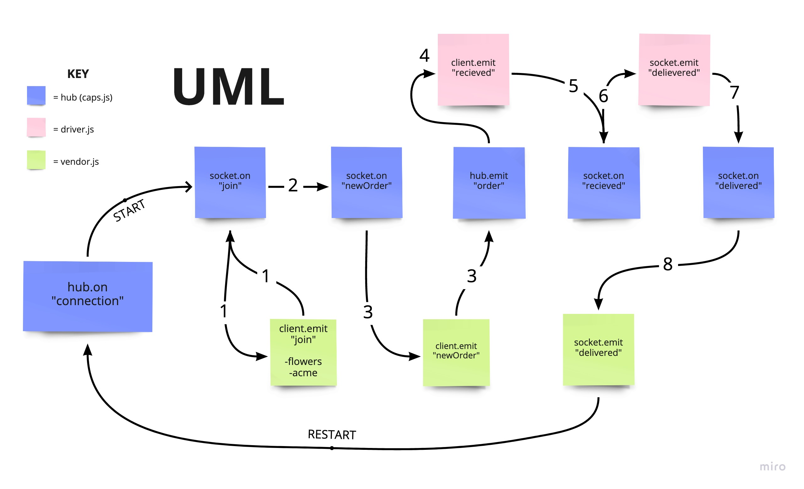

# Lab 11 - Day 1 - 401 JavaScript
# CAPS - The Code Academy Parcel Service
## Author: Lydia Minehan-Tubic

### Links and Resources

✨ [Pull Request](https://github.com/LydiaMT/caps/pull/1)

### Set Up

- [Node.js Docs](https://nodejs.org/api/events.html)
- [faker.js](https://www.npmjs.com/package/faker) to use fake data
- [Swagger.io](https://inspector.swagger.io/builder) to test requests 

### User Stories

#### Client

- As a vendor, I want to alert the system when I have a package to be picked up
- As a driver, I want to be notified when there is a package to be delivered
- As a driver, I want to alert the system when I have picked up a package and it is in transit
- As a driver, I want to alert the system when a package has been delivered
- As a vendor, I want to be notified when my package has been delivered

#### Developer

- As a developer, I want to use industry standards for managing the state of each package
- As a developer, I want to create an event driven system so that I can write code that happens in response to events, in real time

### Technical Requirements

The CAP system should have the following modules:
- `events.js`: Global Event Pool (shared by all modules)
- `caps.js`: Main Hub Application
  - Manages the state of every package (ready for pickup, in transit, delivered, etc)
  - Logs every event to the console with a timestamp and the event payload
  - i.e. “EVENT {}”
- `vendors.js`: Vendor Module
  - Declare your store name (perhaps in a .env file, so that this module is re-usable)
  - Every 5 seconds, simulate a new customer order
    - Create a fake order, as an object: { storeName, orderId, customerName, address }
    - Emit a ‘pickup’ event and attach the fake order as payload. **HINT**: Have some fun by using the faker library to make up phony information
  - Monitor the system for events. Whenever the ‘delivered’ event occurs, Log “thank you” to the console

- `driver.js`: Drivers Module
  - Monitor the system for events
  - On the ‘pickup’ event: 
    - (1) Wait 1 second, (2) Log “DRIVER: picked up [ORDER_ID]” to the console, (3) Emit an ‘in-transit’ event with the payload you received
    - (1) Wait 3 seconds, (2) Log “delivered” to the console, (3) Emit a ‘delivered’ event with the same payload

### Data Model
```js
EVENT { event: 'pickup',
  time: 2020-03-06T18:27:17.732Z,
  payload:
   { store: '1-206-flowers',
     orderID: 'e3669048-7313-427b-b6cc-74010ca1f8f0',
     customer: 'Jamal Braun',
     address: 'Schmittfort, LA' } }
DRIVER: picked up e3669048-7313-427b-b6cc-74010ca1f8f0
EVENT { event: 'in-transit',
  time: 2020-03-06T18:27:18.738Z,
  payload:
   { store: '1-206-flowers',
     orderID: 'e3669048-7313-427b-b6cc-74010ca1f8f0',
     customer: 'Jamal Braun',
     address: 'Schmittfort, LA' } }
DRIVER: delivered up e3669048-7313-427b-b6cc-74010ca1f8f0
VENDOR: Thank you for delivering e3669048-7313-427b-b6cc-74010ca1f8f0
EVENT { event: 'delivered',
  time: 2020-03-06T18:27:20.736Z,
  payload:
   { store: '1-206-flowers',
     orderID: 'e3669048-7313-427b-b6cc-74010ca1f8f0',
     customer: 'Jamal Braun',
     address: 'Schmittfort, LA' } }
...
```

### Test

run `node caps.js` to see the output of your console logs in your terminal 

### UML/WRRC


### Contributors & Resources

- Thank you Dan Engel for helping me organize my events

# Lab 12 | Day 2 |401 JavaScript

### Links and Resources

✨ [Pull Request](https://github.com/LydiaMT/caps/pull/6)

### Technical Requirements

In order to switch from TCP to Socket.io, the refactoring process will involve changes to each application to use the core features of Socket.io. Specifically, we’re going to use Socket.io **namespaces** to segment our events.

- As a developer, I want to create network event driven system using Socket.io so that I can write code that responds to events originating from both servers and web applications
- In order to switch from TCP to Socket.io, the refactoring process will involve changes to each application to use the core features of Socket.io
- We’ll use one namespace called `caps` where all of our clients (vendors and drivers) will connect

CAPS Application Server Modifications: 
- Create and accept connections on a namespace called caps
- Monitor the correct general events: pickup, in-transit, delivered
- Broadcast the events and payload back out to the appropriate clients in the caps namespace
  - Pickup can go out to all sockets (broadcast it) so that the drivers can hear it
  - In-transit and delivered are meant to be heard only by the right vendor

Vendor Application:
- Connects to the CAPS server as a socket.io client to the caps namespace
- Every .5 seconds, simulate a new customer order
- Listen for the delivered event coming in from the CAPS server

Driver Application:
- Connects to the CAPS server as a socket.io client to the caps namespace
- Listen for the pickup event coming in from the CAPS server
- Simulate picking up the package
- Simulate delivering the package

### Testing

- [Web Testing Application](https://javascript-401.netlify.app/)
- You can also test functionality in your terminal. Open 3 panes and then run each socket from the root of the directory
  1. `node events.js`
  2. `node caps.js`
  3. `node customers/vendors/vendor.js`
  4. `node customers/drivers/driver.js` 

### UML/WRRC


# Lab 13 - Day 3 - 401 JavaScript

✨ [Pull Request](https://github.com/LydiaMT/caps/pull/8)

### Technical Requirements

- A Queue Server Hub that:
  - Keeps a log of the delivery, keyed by retailer and event type
  - Broadcasts “Delivery Confirmations” to retailers
- Client (Vendor) Applications that retailers would run, which subscribe to the Queue so that they can be alerted when a delivery was made
  - When a client receives a message, it will need to let the hub server know that it was received
  - The hub server should then delete the message
  - Client can ask for all undelivered messages from the server
  - Each of these would also need to be acknowledged upon receipt

### Data Model 

```js
// Out for delivery
queue {
  '1-206-flowers': {
    newOrder: { '498d7ad9-0f55-482e-8d72-c018d46b2651': { "order details" } },
    received: {}
  },
  'acme-widgets': {
    newOrder: { 'a597712b-3bea-4404-a1d7-49b5302451a5': { "order details" } },
    received: {}
  }
}

// received
queue {
  '1-206-flowers': {
    newOrder: {},
    received: { '498d7ad9-0f55-482e-8d72-c018d46b2651': { "order details" }  }
  },
  'acme-widgets': {
    newOrder: {},
    received: { 'a597712b-3bea-4404-a1d7-49b5302451a5': { "order details" } }
  }
}

```

### Testing

- You can test functionality in your terminal. Open 3 panes and then run each socket from the root of the directory
  1. `node hub.js`
  2. `node clients/vendors/vendor.js`
  3. `node clients/drivers/driver.js` 

### UML/WRRC


